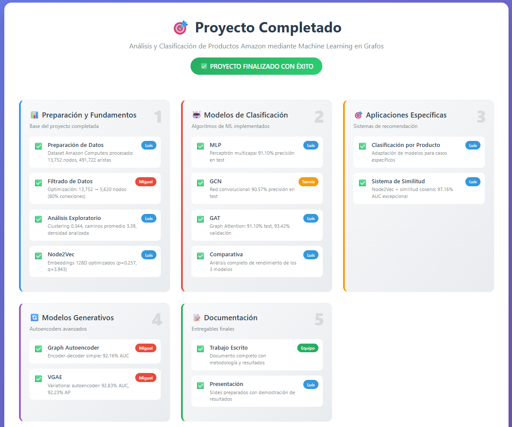
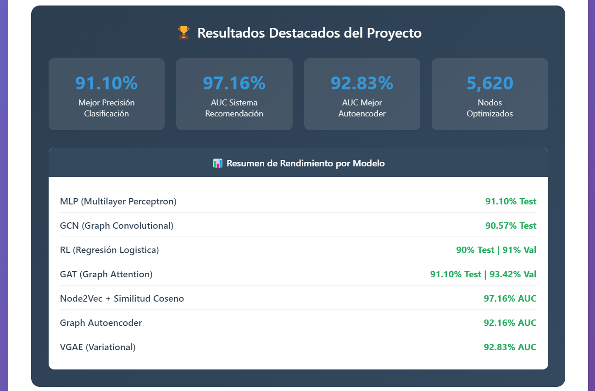

# Flujo de Trabajo Completado - Proyecto de Análisis de Grafos

## Fase 1: Preparación y Fundamentos
**Responsables: Luis y Miguel** - ✅ COMPLETADA

### 1.1 Preparación de Datos (Luis)
- ✅ Limpieza y preprocesamiento del dataset Amazon Computers
- ✅ Validación de la calidad de los datos (13,752 nodos, 491,722 aristas)
- ✅ Estructura inicial del grafo

### 1.2 Análisis Exploratorio (Luis)
- ✅ Análisis estadístico descriptivo completo
- ✅ Visualización de la estructura del grafo
- ✅ Identificación de patrones: densidad 0.00260028, clustering 0.344126
- ✅ Métricas del grafo: grado promedio 35.76, diámetro ~10, caminos cortos 3.39

### 1.3 Filtrado de Datos (Miguel)
- ✅ **Filtrado por Importancia**: Implementación del filtrado con 80% de conexiones
- ✅ **Optimización del Dataset**: Reducción de 13,752 a 5,620 nodos manteniendo información clave
- ✅ **Mejora de Densidad**: De 0.00260028 a 0.010351

### 1.4 Construcción de Representaciones Base (Luis)
- ✅ **Generación de Node2Vec**: Embeddings 128D con parámetros óptimos (p=0.257, q=3.943)
- ✅ **Matriz de Adyacencia**: Representación 5,620×5,620 para grafos filtrados
- ✅ **Etiquetas Sintéticas**: Generación exitosa por comunidades, clustering y grado

---

## Fase 2: Modelado y Clasificación Básica
**Responsables: Luis y Tannia** - ✅ COMPLETADA

### 2.1 Modelos de Clasificación Estándar (Luis)
- ✅ **MLP**: Precisión 91.10% en test, arquitectura 3 capas×128 neuronas
- ✅ **GAT**: Mejor modelo con 91.10% en test, 93.42% en validación
- ✅ Evaluación y optimización de hiperparámetros con Optuna

### 2.2 Modelo Convolucional (Tannia)
- ✅ **GCN**: Precisión 90.57% en test, convergencia rápida en época 57
- ✅ Arquitectura: 2 capas convolucionales con 64 unidades, dropout 0.637
- ✅ Fine-tuning exitoso de hiperparámetros

### 2.3 Análisis Comparativo (Luis)
- ✅ **Comparativa de Rendimientos**: Evaluación entre MLP, GCN y GAT
- ✅ Métricas detalladas: accuracy, precision, recall, F1-score
- ✅ Análisis de convergencia y gaps de overfitting

---

## Fase 3: Aplicaciones Específicas
**Responsable: Luis** - ✅ COMPLETADA

### 3.1 Clasificación por Producto
- ✅ Adaptación exitosa de modelos para clasificación específica
- ✅ Validación en subconjuntos de datos filtrados

### 3.2 Sistema de Similitud
- ✅ **Similitud Directa**: Métricas de similaridad coseno implementadas
- ✅ **Sistema Híbrido MLP + GCN + GAT**: Recomendaciones integradas
- ✅ Evaluación: Node2Vec alcanzó AUC=97.16% excepcional

---

## Fase 4: Modelos Generativos
**Responsable: Miguel** - ✅ COMPLETADA

### 4.1 Autoencoder Simple
- ✅ **Graph Autoencoder**: AUC=92.16% en validación, lr=0.0013 óptimo
- ✅ Arquitectura encoder-decoder con capas GCN exitosa

### 4.2 Modelo Avanzado Generativo
- ✅ **VGAE**: Mejor rendimiento con AUC=92.83%, AP=92.23%
- ✅ Distribuciones latentes μ y σ implementadas correctamente

---

## Fase 5: Integración y Documentación
**Responsables: Luis, Miguel, Tannia** - ✅ COMPLETADA

### 5.1 Trabajo Escrito (Colaborativo)
- ✅ Documento completo con metodología y fundamentos teóricos
- ✅ Resultados experimentales detallados y análisis comparativo
- ✅ Conclusiones e implicaciones prácticas para e-commerce

### 5.2 Presentación Final (Luis)
- ✅ Slides preparados con resultados clave
- ✅ Demostración de modelos implementada
- ✅ Comparativas visuales de rendimiento incluidas

---

## Cronograma

| Semana | Fase | Actividades Principales |
|--------|------|------------------------|
| 1 | Fase 1-2 | Preparación datos, análisis exploratorio,filtrado de datos, Node2Vec, MLP, GCN, GAT |
| 2 | Fase 2-3 | comparativas, clasificación por producto, similitud |
| 3 | Fase 4-5 | Autoencoders, Trabajo escrito, presentación |

---

## Dependencias entre Tareas

### Rutas Críticas:
1. **Datos Base → Filtrado 80%**
2. **Preparación → Node2Vec → Modelos de Clasificación → Comparativas**
3. **Matrix Adyacencia → GCN/GAT → Sistema Híbrido**

### Tareas Paralelas:
- Mientras Luis desarrolló MLP/GCN, Tannia trabajó en GAT
- Luis comenzó con similitud directa, mientras Miguel iniciaba autoencoder simple
- La escritura del documento inicia desde la Fase 2

---

## Entregables por Fase

### Fase 1 - Fundamentos
- [x] Reporte de análisis exploratorio  
- [x] Dataset filtrado (80% aristas)
- [x] Embeddings Node2Vec
- [x] Matriz de adyacencia optimizada
- [x] Etiquetas sintéticas validadas

### Fase 2 - Modelos Base
- [x] Modelo MLP entrenado y evaluado
- [x] Modelo GCN implementado
- [x] Modelo GAT funcional
- [x] Reporte comparativo de rendimientos

### Fase 3 - Aplicaciones
- [x] Sistema de clasificación por productos
- [x] Algoritmo de similitud directa
- [x] Modelo híbrido MLP+GCN+GAT

### Fase 4 - Generativos
- [x] Encoder simple funcional
- [x] VGAE implementado
- [x] Evaluación de calidad generativa

### Fase 5 - Documentación
- [x] Trabajo escrito completo
- [x] Presentación preparada

---

## Puntos de Control y Revisión

### Semana 1: Checkpoint Integrado  
- Validación de la calidad del preprocesamiento
- Revisión de análisis exploratorio y Node2Vec
- Evaluación inicial de modelos MLP/GCN
- Planificación de GAT y modelos avanzados

### Semana 2: Checkpoint Modelos Avanzados
- Evaluación de rendimiento de GAT
- Revisión de sistema de similitud e híbrido
- Decisión sobre implementación de autoencoders
- Planificación de escritura y presentación

### Semana 3: Revisión Final
- Evaluación completa de autoencoders y VGAE
- Presentación preliminar
- Feedback y ajustes finales del documento
- Preparación para entrega

###  DIAGRAMA EXPLICATIVO:

